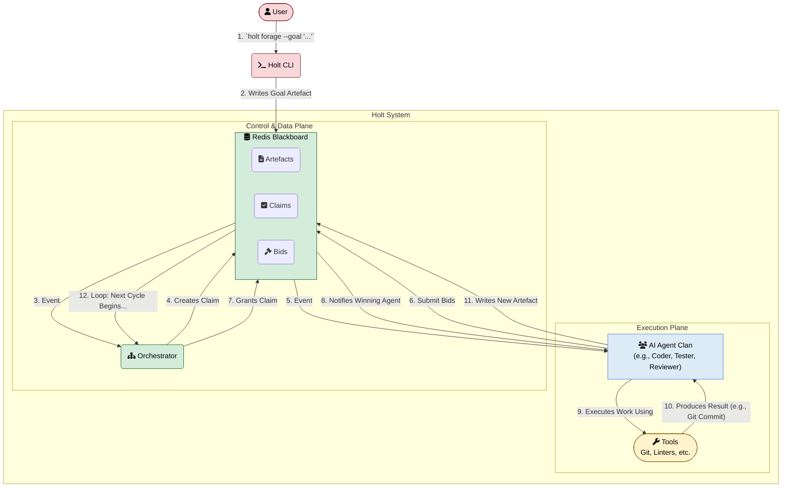

# Holt

**The Enterprise-Grade AI Orchestrator for Secure, Auditable, and Compliant Workflows**

Holt enables organizations to safely automate complex software engineering tasks using AI agents—while maintaining complete control, security, and regulatory compliance.

---

## Enterprise-Ready by Design

Holt is an opinionated, integrated platform, purpose-built for secure and regulated environments. Its architecture provides enterprise-grade capabilities out-of-the-box.

*   **Absolute Data Sovereignty**: Holt is self-hosted by default, allowing for deployment in **air-gapped environments**. The entire platform runs on your infrastructure, ensuring no data, metadata, or logs ever leave your security perimeter.
*   **Unparalleled Auditability**: The central "Blackboard" acts as a chronological, append-only ledger, providing a complete audit trail of every action taken by every agent.

---

## Compliance and Security

Holt is architected to support the stringent security and compliance requirements of regulated industries. Its self-hosted nature, chronological audit trail, and declarative policies provide the foundation needed to build a compliant system.

For a detailed guide on how Holt's features map to the technical controls of frameworks like **HIPAA, SOC 2, and ISO 27001**, please read our full compliance guide:

**[➡️ Holt: A Guide to Compliance](./HOLT_COMPLIANCE_GUIDE.md)**

---

## Quick Start

### Prerequisites

- **Docker** (20.10+) - For running agent containers
- **Git** (2.x+) - For workspace management
- **Go** (1.21+) - For building Holt binaries

### Installation & First Workflow

```bash
# 1. Clone repository
git clone https://github.com/dyluth/holt.git
cd holt

# 2. Build binaries
make build

# 3. Create test project
mkdir my-project && cd my-project
git init
git commit --allow-empty -m "Initial commit"

# 4. Initialize Holt
holt init

# 5. Build example git agent
docker build -t example-git-agent:latest -f agents/example-git-agent/Dockerfile ..

# 6. Configure agent in holt.yml
cat > holt.yml <<EOF
version: "1.0"
agents:
  git-agent:
    role: "Git Agent"
    image: "example-git-agent:latest"
    command: ["/app/run.sh"]
    workspace:
      mode: rw
services:
  redis:
    image: redis:7-alpine
EOF

# 7. Start Holt instance
holt up

# 8. Create workflow
holt forage --goal "hello.txt"

# 9. Watch agent execute
holt watch

# 10. View results
holt hoard
git log --oneline
ls -la hello.txt  # File created by agent!
```

**What just happened?**

1. Holt started an orchestrator and your git agent in Docker containers
2. The orchestrator created a claim for your goal ("hello.txt")
3. The git agent bid on and won the claim
4. The agent created `hello.txt` in your workspace and committed it
5. A `CodeCommit` artefact was created on the blackboard with the commit hash
6. Complete audit trail preserved in Redis and Git history

---

## How It Works: A Conceptual Overview

This diagram illustrates the high-level conceptual workflow of the Holt system, demonstrating how a user goal initiates a collaborative, auditable process between the orchestrator and a clan of specialized AI agents interacting via the central Redis Blackboard.



## Project Status

**Phase 4 In Progress** 🚧 - Human-in-the-loop and production hardening.

### Key Completed Features (Phases 1-3)

*   **Core Orchestration**: Event-driven engine, Redis blackboard, Git-native workflows.
*   **Advanced Coordination**: Multi-agent consensus bidding and phased execution (Review, Parallel, Exclusive).
*   **Resilience & Scaling**: Controller-worker pattern for horizontal scaling, orchestrator restart resilience, and automated feedback loops for agent self-correction.
*   **Security & Audit**: Immutable audit trail, workspace isolation (`ro`/`rw` modes), and multi-instance safety.

---

## Core Concepts

### The Blackboard

A Redis-based shared state system where all components interact. Think of it as a lightweight ledger storing:

- **Artefacts**: Append-only work products (code commits, designs, analyses)
- **Claims**: The orchestrator's decisions about work assignment
- **Bids**: Agents' expressions of interest in claims

Every interaction is timestamped and recorded, creating a chronological audit trail perfect for regulated environments.

### Artefacts

Append-only data objects representing work products. Each artefact has:

- **type**: User-defined (e.g., "CodeCommit", "DesignSpec", "TestReport")
- **payload**: Main content (commit hash, JSON data, text)
- **source_artefacts**: Dependency chain for provenance tracking
- **structural_type**: Role in orchestration (Standard, Review, Question, Answer, Failure, Terminal)

Artefacts never change. Instead, new versions form logical threads tracked via `logical_id`.

### Claims & Phased Execution

When an artefact is created, the orchestrator creates a **claim** and agents bid on it. Claims progress through phases:

1. **Review Phase**: Parallel review by multiple agents (Phase 3)
2. **Parallel Phase**: Concurrent work by multiple agents (Phase 3)
3. **Exclusive Phase**: Single agent gets exclusive access ✅ (Phase 2)

Agents submit bids ("review", "claim", "exclusive", "ignore") based on their capabilities and the work required.

### The Agent Pup

A lightweight Go binary that runs as the entrypoint in every agent container. It:

- Watches for claims via Pub/Sub
- Submits bids on behalf of the agent
- Assembles historical context via graph traversal
- Executes the agent's tool script with JSON contract
- Creates artefacts from tool output
- Operates concurrently to remain responsive

**Key insight:** The pup handles orchestration complexity. You just write the tool logic.

### Agents

Docker containers packaging:

1. **Agent pup binary** (handles Holt integration)
2. **Tool script** (your custom logic - shell, Python, anything)
3. **Dependencies** (LLM APIs, compilers, CLIs, etc.)

Agents communicate with the pup via stdin/stdout JSON:

**Input:**
```json
{
  "claim_type": "exclusive",
  "target_artefact": { "type": "GoalDefined", "payload": "build auth API", ... },
  "context_chain": [ /* historical artefacts */ ]
}
```

**Output:**
```json
{
  "artefact_type": "CodeCommit",
  "artefact_payload": "abc123def456...",
  "summary": "Implemented authentication endpoints"
}
```

### Git-Centric Workflow

Holt assumes and requires a clean Git repository. Code artefacts are git commit hashes, and agents are responsible for:

- Creating or modifying files
- Committing changes with descriptive messages
- Returning commit hashes as `CodeCommit` artefacts

The pup validates commit hashes exist before creating artefacts, ensuring integrity.

### Human-in-the-Loop

Holt is designed for human oversight:

- **Question artefacts**: Agents can ask humans for guidance (Phase 4)
- **Review phase**: Humans or review agents can provide feedback before execution (Phase 3)
- **Complete audit trail**: Every decision is traceable for compliance
- **Manual intervention**: Humans can inspect state and intervene at any point
```

---

## CLI Commands

### Instance Management

```bash
# Initialize new Holt project
holt init

# Start Holt instance (auto-incremented name: default-1, default-2, ...)
holt up

# Start with specific name
holt up --name prod

# Stop instance (infers most recent if name omitted)
holt down
holt down --name prod

# List all running instances
holt list
```

### Workflow Management

```bash
# Create workflow with a goal
holt forage --goal "Build REST API for user management"

# Target specific instance
holt forage --name prod --goal "Refactor authentication"

# Validate orchestrator creates claim (Phase 1)
holt forage --watch --goal "Add logging to endpoints"
```

### Monitoring & Debugging

```bash
# View live activity (infers most recent instance)
holt watch

# Target specific instance
holt watch --name prod

# View all artefacts on blackboard
holt hoard

# View agent logs
holt logs git-agent
holt logs orchestrator

# View questions requiring human input (Phase 4)
holt questions --wait

# Answer a question (Phase 4)
holt answer <question-id> "Use JWT tokens with RS256"
```

---

## Building Custom Agents

### Minimal Echo Agent

**agents/my-agent/run.sh:**
```bash
#!/bin/sh
input=$(cat)

# Extract goal from payload
goal=$(echo "$input" | grep -o '"payload":"[^"]*"' | head -1 | cut -d'"' -f4)

echo "Processing: $goal" >&2

# Output result
cat <<EOF
{
  "artefact_type": "Processed",
  "artefact_payload": "Result for $goal",
  "summary": "Processing complete"
}
EOF
```

**agents/my-agent/Dockerfile:**
```dockerfile
FROM golang:1.24-alpine AS builder
WORKDIR /build
COPY go.mod go.sum ./
RUN go mod download
COPY cmd/pup ./cmd/pup
COPY internal/pup ./internal/pup
COPY pkg/blackboard ./pkg/blackboard
RUN CGO_ENABLED=0 go build -o pup ./cmd/pup

FROM alpine:latest
RUN apk --no-cache add ca-certificates
WORKDIR /app
COPY --from=builder /build/pup /app/pup
COPY agents/my-agent/run.sh /app/run.sh
RUN chmod +x /app/run.sh
RUN adduser -D -u 1000 agent
USER agent
ENTRYPOINT ["/app/pup"]
```

**holt.yml:**
```yaml
version: "1.0"
agents:
  my-agent:
    role: "My Agent"
    image: "my-agent:latest"
    command: ["/app/run.sh"]
    workspace:
      mode: ro
services:
  redis:
    image: redis:7-alpine
```

**Build & Run:**
```bash
docker build -t my-agent:latest -f agents/my-agent/Dockerfile .
holt up
holt forage --goal "test input"
holt logs my-agent
```

For complete agent development guide, see: **[docs/agent-development.md](./docs/agent-development.md)**

---

## Example Agents

### Echo Agent
**Location:** `agents/example-agent/`

Simple agent demonstrating basic stdin/stdout contract. Reads goal, logs it, outputs success artefact.

**Use case:** Learning, testing, proof-of-concept

### Git Agent
**Location:** `agents/example-git-agent/`

Creates files in workspace and commits them, returning `CodeCommit` artefacts.

**Use case:** Code generation, file creation, project scaffolding

**Example workflow:**
```bash
# Build agent
docker build -t example-git-agent:latest -f agents/example-git-agent/Dockerfile .

# Start Holt
holt up

# Create file via agent
holt forage --goal "implementation.go"

# Verify result
git log --oneline  # Shows commit by agent
ls implementation.go  # File exists
holt hoard  # Shows CodeCommit artefact
```

---

## Development

### Building from Source

```bash
# Build all binaries
make build

# Build specific binary
make build-cli
make build-orchestrator
make build-pup

# Run tests
make test

# Run integration tests (requires Docker)
make test-integration

# Check coverage
make coverage
```

### Project Structure

```
holt/
├── cmd/                      # Binaries
│   ├── holt/                # CLI
│   ├── orchestrator/        # Orchestrator daemon
│   └── pup/                 # Agent pup binary
├── internal/                # Private packages
│   ├── pup/                 # Pup logic
│   ├── orchestrator/        # Orchestrator engine
│   ├── config/              # Configuration
│   ├── git/                 # Git integration
│   └── testutil/            # E2E test helpers
├── pkg/blackboard/          # Public blackboard client
├── agents/                  # Example agents
│   ├── example-agent/       # Echo agent
│   └── example-git-agent/   # Git workflow agent
├── design/                  # Design documents
│   ├── features/            # Feature specs by phase
│   └── holt-system-specification.md
└── docs/                    # User documentation
    ├── agent-development.md # Agent building guide
    └── troubleshooting.md   # Common issues & solutions
```

---

## Guiding principles


### Pragmatism over Novelty (YAGNI)

We use battle-hardened tools (Docker, Redis, Git) rather than building custom solutions. Holt is an orchestrator, not a database or container runtime.

### Zero-Configuration, Progressively Enhanced

`holt init && holt up` creates a working system. Smart defaults cover 90% of use cases. Advanced features available when needed.

### Auditability as a Core Feature

The Holt platform treats artefacts as write-once records. Every decision is recorded on the blackboard with timestamps. Complete audit trail for compliance and debugging.

### Small, Single-Purpose Components

Each component (orchestrator, CLI, agent pup) has one job and does it excellently. Complexity is managed through composition.

### Container-Native by Design

Agents can use any tool that can be containerized - not just Python functions. This enables orchestration of compilers, CLIs, infrastructure tools, and more.

---

## Roadmap

Holt is being developed through a series of well-defined phases, from the initial "Heartbeat" to a fully "Kubernetes-Native" platform. For a detailed overview of the project's phased delivery plan and future direction, please see our comprehensive roadmap:

**[➡️ View the Full Project Roadmap](./ROADMAP.md)**

### Future Enhancements
For a detailed look at long-term, enterprise-focused ideas like RBAC, Secrets Management, and High Availability, see the living document at **[design/future-enhancements.md](./design/future-enhancements.md)**.

---

## Documentation

- **[Agent Development Guide](./docs/agent-development.md)** - Build custom agents
- **[Troubleshooting Guide](./docs/troubleshooting.md)** - Common issues & solutions
- **[Project Context](./PROJECT_CONTEXT.md)** - Philosophy, principles, vision
- **[System Specification](./design/holt-system-specification.md)** - Complete architecture
- **[Feature Design Template](./design/holt-feature-design-template.md)** - Development process

---

## Contributing

Holt uses a systematic, template-driven feature design process. Every feature must be designed using the standardized template before implementation.

**Process:**

1. **Design**: Create feature document using `design/holt-feature-design-template.md`
2. **Review**: Iterate on design with human review
3. **Implement**: Build feature according to approved design
4. **Test**: Comprehensive unit, integration, and E2E tests
5. **Validate**: Verify against success criteria and Definition of Done

See `DEVELOPMENT_PROCESS.md` for details.

---

## License

MIT License - See [LICENSE](./LICENSE) for details.

---

## Support

- **Issues**: https://github.com/dyluth/holt/issues
- **Documentation**: Start with this README, then see `docs/`
- **Examples**: See `agents/` directory for reference implementations

---

## Acknowledgments

Built by Cam McAllister as an enterprise-grade AI orchestration platform with auditability and compliance as first-class features.

---

**Ready to build AI workflows with full audit trails? Start with the [Quick Start](#quick-start) above.**