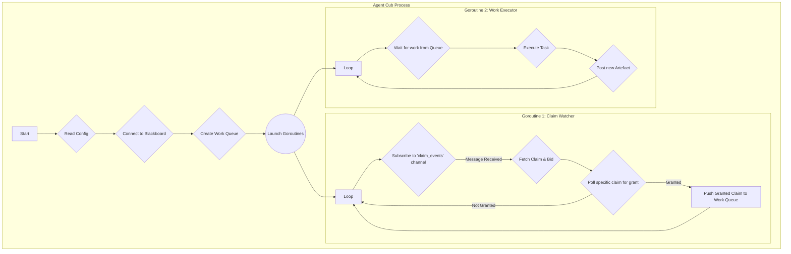

# **The agent cub: design & specification**

## **1\. Core purpose**

The Agent Cub is the brain and nervous system of every agent in a Sett. It is a lightweight, standalone binary that runs as the entrypoint inside the agent's container.

Its fundamental purpose is to bridge the gap between the stateless, tool-equipped container and the stateful, shared blackboard. It is the component that manages the agent's entire lifecycle, from bidding on work to executing tasks and publishing results. For LLM-driven agents, it is responsible for all communication with the model, acting as the intelligent layer that translates blackboard state into high-context prompts.

## **2\. Key responsibilities**

The cub is responsible for the following functions:

* **Initialisation:** Read configuration from environment variables to identify itself and connect to the correct Redis instance.  
* **Blackboard communication:** Act as the sole client to the blackboard for all reads and writes.  
* **Claim lifecycle management:** Watch for new claims, evaluate them, and submit bids.  
* **Work acquisition:** Monitor for granted claims to know when to begin execution.  
* **Context assembly:** For LLM-driven agents, traverse the artefact dependency graph on the blackboard to build a rich, historical context.  
* **LLM interaction:** Format prompts, send them to the configured LLM API, and parse the structured response.  
* **Tool execution:** Execute the tools available within its container based on instructions from the LLM or a deterministic workflow.  
* **Artefact creation:** Format the results of its work into a new, valid Artefact and post it to the blackboard.  
* **Error handling:** Report execution failures by creating Failure artefacts.

## **3\. The event-driven concurrent model**

The cub is a concurrent application that runs two primary processes in parallel as goroutines. This ensures that the agent remains responsive to new claims on the blackboard even while it is busy executing a long-running task. The two loops communicate via an internal work queue (a Go channel).

1. **The Claim Watcher:** This goroutine is the agent's "ear" to the blackboard. It uses **Redis Pub/Sub** to subscribe to the `claim_events` channel. Instead of polling, it blocks efficiently, waiting for the orchestrator to publish a notification about a new claim. Once notified, it fetches the claim details, evaluates it, and submits a bid. It then performs a targeted, low-frequency poll on that specific claim's status until a decision is made. When a claim is granted, it places the granted Claim object onto the internal work queue for the executor.  
2. **The Work Executor:** This goroutine is the "workhorse". It blocks and waits for a granted Claim to appear on the internal work queue. Once it receives a task, it performs the entire execution lifecycle: assembling the context, interacting with the LLM or running tools, and finally posting the resulting Artefact back to the blackboard.

This event-driven, concurrent design ensures the sett can operate at maximum efficiency, as agents are never too busy to evaluate new opportunities.

### **Agent cub concurrent architecture**



## **4\. The context assembly algorithm**

This is the core of the cub's intelligence layer. It makes the agent appear stateful by providing it with a deep historical context for any given task.

**Algorithm:**

1. **Start traversal:** Begin with the list of source\_artefacts from the Artefact the agent is working on.  
2. **Initialise data structures:** Create a queue of artefact IDs to visit and a map to store the final, de-duplicated context.  
3. **Walk the graph (Breadth-First Search):**  
   * For each id in the queue:  
     * Fetch the full Artefact from the blackboard.  
     * Using its logical\_id, query the blackboard thread tracking (Redis ZSET at `sett:{instance_name}:thread:{logical_id}`) to find the artefact in that logical thread with the highest version number. This is the **"shortcut"** that ensures the context is always the most recent.  
     * Add this latest-version artefact to the final context map (keyed by logical\_id to prevent duplicates).  
     * Add all of its source\_artefacts to the queue for the next level of traversal.  
4. **Assemble prompt:** The collected artefacts in the context map are serialised into JSON and passed to the agent command script.

**Depth limits and safety:** The V1 implementation will have a hardcoded traversal depth limit of 10 levels as a safety valve to prevent excessive context size and potential infinite loops in malformed graphs. Future versions will include robust loop detection by tracking visited artefact IDs.

## **5\. Configuration and initialisation**

The orchestrator is responsible for providing the cub with its identity and environment via standard container mechanisms.

**Environment variables:**

The orchestrator provides the cub with its identity and environment via standard container mechanisms:

* **SETT\_INSTANCE\_NAME:** The name of the sett it belongs to (e.g., my-first-sett). Used to construct Redis key prefixes.
* **SETT\_AGENT\_NAME:** The agent's unique logical name from sett.yml (e.g., go-coder-agent). This is its identity for bidding.
* **REDIS\_URL:** The connection string for the blackboard (e.g., redis://sett-my-first-sett-redis:6379).
* **SETT\_PROMPT\_CLAIM:** The claim prompt from the agent's sett.yml `prompts.claim` field (for LLM-driven agents).
* **SETT\_PROMPT\_EXECUTION:** The execution prompt from the agent's sett.yml `prompts.execution` field (for LLM-driven agents).
* **Additional environment variables:** As defined in the agent's sett.yml `environment` section (e.g., GITHUB_TOKEN, LOG_LEVEL).

**Mounted files and workspace:**

* **Project workspace:** The agent's container has the project's working directory (Git repository root) mounted as the default workspace. The mount mode ('ro' or 'rw') is specified in the agent's sett.yml `workspace` configuration.
* **Prompts:** The agent's prompts (claim, execution) are passed as environment variables. The orchestrator reads the prompts from the sett.yml file and injects them into the agent container as `SETT_PROMPT_CLAIM` and `SETT_PROMPT_EXECUTION` environment variables.

## **6\. Tool execution contract**

The cub's interaction with agent-specific tools is defined by a simple, robust contract. The cub binary is always the entrypoint of the agent container. It then acts as a generic runner that executes a **single, mandatory command** defined in the agent's sett.yml configuration. This decouples the core cub logic from the implementation details of any specific tool.

This entrypoint script is responsible for:

1. Parsing the context provided by the cub via stdin.  
2. Calling the relevant tool (e.g., an LLM, a test runner, a linter).  
3. Translating the tool's output into a structured JSON response.  
4. Printing that single JSON response to stdout.

### **Input to the script (passed via stdin)**

The cub passes a single JSON object to the script's stdin. This object contains the full historical context for the task and indicates what type of work is being granted.

**Complete input schema:**

```json
{
  "claim_type": "exclusive",
  "target_artefact": {
    "id": "artefact-uuid-123",
    "logical_id": "logical-uuid-abc",
    "version": 2,
    "structural_type": "Standard",
    "type": "DesignSpec",
    "payload": "Create a REST API for user management.",
    "source_artefacts": ["artefact-uuid-007"],
    "produced_by_role": "architect"
  },
  "context_chain": [
    {
      "id": "artefact-uuid-007",
      "logical_id": "logical-uuid-xyz",
      "version": 1,
      "structural_type": "Standard",
      "type": "GoalDefined",
      "payload": "Build a web application.",
      "source_artefacts": [],
      "produced_by_role": "user"
    }
  ]
}
```

**Field descriptions:**

* **claim_type:** A string indicating the type of work being granted: 'review', 'claim', or 'exclusive'
* **target_artefact:** The full JSON object of the artefact that the claim was created for
* **context_chain:** A JSON array containing the full objects of the latest version of every artefact in the historical chain, assembled by the cub's context assembly algorithm

**Workspace access:** The script's current working directory is the root of the mounted project workspace (Git repository). It can navigate and interact with files using standard shell commands.

### **Output from the script (read from stdout)**

The cub expects the script to produce a single JSON object on stdout. This object contains the necessary information for the cub to create the next Artefact.

**Standard output schema:**

```json
{
  "artefact_type": "CodeCommit",
  "artefact_payload": "f4be2d6",
  "summary": "Implemented the user authentication endpoint as requested."
}
```

**Question escalation schema:**

A script can create a Question artefact by outputting specific JSON to stdout:

```json
{
  "structural_type": "Question",
  "payload": "The design spec is ambiguous about null handling. Is it in scope?"
}
```

**Git workflow:** For code changes, the agent's command script is responsible for all Git interactions. The script should:
1. Make code changes in the workspace
2. Commit the changes using standard Git commands
3. Return the resulting commit hash as the `artefact_payload`

The cub's only job is to capture the resulting commit hash from the script's stdout and place it in the artefact's payload.

## **7\. Operational policies and fault tolerance**

To be a robust, usable component, the cub must adhere to a clear set of operational policies.

### **7.1. Health checks and lifecycle**

The cub must be a good citizen within a containerised environment, compatible with orchestrators like Docker and Kubernetes.

* **Signal handling:** The cub must handle SIGINT and SIGTERM signals gracefully. Upon receiving a signal, the Claim Watcher goroutine must stop accepting new work, and the Work Executor must be allowed to finish its current task (with a reasonable, configurable timeout) before the process exits cleanly.
* **Health checks:** The cub exposes a `GET /healthz` endpoint that returns `200 OK` if connected to Redis, `503 Service Unavailable` otherwise. The Orchestrator (or Kubernetes) can use this for liveness and readiness probes to distinguish between a busy agent and a dead one.
* **Work queue size:** An agent's cub can only work on one granted claim at a time. Its internal work queue has a size of one. While the Work Executor is busy, the Claim Watcher can continue to bid on new claims, but new work will be queued until the current task is complete.

### **7.2. Network resilience**

All external network calls made by the cub (to Redis or LLM APIs) must be resilient to transient failures.

* **Timeouts:** All network clients must have short, configurable timeouts.  
* **Retry policy:** A simple, exponential backoff retry policy (e.g., 3 retries) must be implemented for all external calls.  
* **Failure state:** If a critical dependency like Redis is unreachable after all retries, the cub's health check must fail. If a non-critical call (like bidding via an LLM) fails, the cub should default to a safe state (e.g., submitting an 'ignore' bid) and log the error.

### **7.3. Robust I/O handling**

The cub must robustly handle the output from the tool command it executes.

* If the script exits with a non-zero status code, or if its stdout is not a single, valid JSON object that matches the expected output schema, the cub **must** treat this as an agent failure.  
* In case of failure, the cub will create a Failure artefact. The payload of this artefact will contain a structured error report, including the exit code, the complete stdout, and stderr from the script to aid debugging.