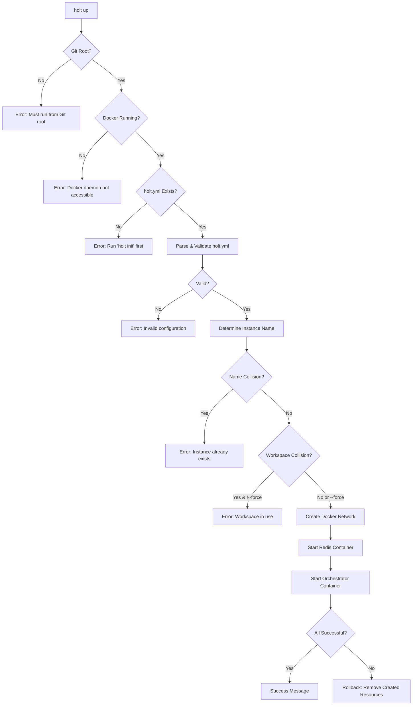

# M1.4: CLI Lifecycle Management

**Status:** Design
**Phase:** 1 - Heartbeat
**Dependencies:** M1.1 (Blackboard Foundation), M1.2 (Client Operations), M1.3 (CLI Init)
**Supersedes:** None

---

## Overview

This milestone implements the core lifecycle management commands for Holt instances: `holt up`, `holt down`, and `holt list`. These commands enable users to start, stop, and inspect Holt orchestration environments, with each instance comprising an isolated Redis container and orchestrator container (placeholder for M1.5).

The design centres on a critical architectural principle: **the Docker API is the single source of truth** for instance state. All discovery, collision detection, and metadata retrieval is performed via Docker container labels, eliminating the need for a shared Redis instance or host-local state files.

---

## Architecture Principles

### 1. **Docker-Centric State Management**

Unlike traditional multi-instance systems that rely on shared databases or lock files, Holt leverages Docker's native label system as its state store:

- **Instance registry:** Query Docker API for containers with `holt.project=true`
- **Name collision detection:** Check for existing `holt.instance.name={name}` label
- **Workspace safety:** Inspect `holt.workspace.path` labels across all instances
- **Lock mechanism:** Container presence = lock (no explicit Redis lock key)

**Benefits:**
- No shared infrastructure required
- Atomic cleanup (removing containers = removing state)
- Survives Redis restarts
- Works across Docker hosts (future Docker Swarm/K8s compatibility)

### 2. **Instance Isolation**

Each Holt instance is a self-contained unit:

```
Instance "prod":
  ├─ Network: holt-network-prod (isolated)
  ├─ Container: holt-redis-prod (blackboard storage)
  └─ Container: holt-orchestrator-prod (claim coordinator - placeholder for M1.5)
```

Instances do **not** share networks, Redis databases, or any runtime state. This ensures:
- Workspace safety (one instance per Git repository)
- No cross-instance interference
- Trivial cleanup (remove containers = remove instance)

### 3. **Namespace Consistency (Future-Proofing)**

Despite per-instance Redis isolation, **all blackboard keys and channels continue to use instance-name prefixes**:

```
holt:prod:artefacts:{id}
holt:prod:claims:{id}
holt:prod:events:artefacts
```

This ensures components remain agnostic to the deployment model. If Holt later migrates to a shared Redis architecture (e.g., for distributed orchestration), no code changes are required—only configuration.

---

## Command Specifications

### `holt up` - Start Instance

#### Synopsis

```bash
holt up [--name <instance-name>] [--force]
```

#### Description

Creates and starts a new Holt instance in the current Git repository. This command performs extensive validation, starts the required Docker containers, and ensures workspace safety.

#### Prerequisites

1. **Git Repository Root:** Must be executed from the root of a Git repository (same constraint as `holt init`)
2. **Docker Daemon:** Docker daemon must be running and accessible
3. **Configuration File:** `holt.yml` must exist at the Git root
4. **No Existing Instance:** Unless `--force` is specified, no other instance can be using this workspace

#### Flags

- `--name <instance-name>` (optional): Unique identifier for this instance
  - If omitted, auto-generates next available `default-N` name (e.g., `default-1`, `default-2`)
  - Determined by querying Docker for existing `holt.instance.name=default-*` labels, finding highest N, and incrementing
  - Must match pattern: `^[a-z0-9][-a-z0-9]*[a-z0-9]$` (DNS-compatible)
  - Max length: 63 characters

- `--force` (optional): Bypass workspace path collision check
  - Allows creating a new instance on a workspace already in use by another instance
  - **Does not** stop or affect the existing instance
  - Useful for testing/development scenarios with multiple instances on same codebase

#### Execution Flow



#### Validation Phases

**Phase 1: Environment Validation**
```go
1. Check current directory is Git repository root
   - Use: git rev-parse --show-toplevel
   - Compare to os.Getwd()

2. Check Docker daemon accessibility
   - Use: docker.NewClientWithOpts(docker.FromEnv)
   - Call: client.Ping(ctx)

3. Check holt.yml exists at ./holt.yml
   - Use: os.Stat("holt.yml")
```

**Phase 2: Configuration Validation**
```go
4. Parse holt.yml
   - Use: yaml.v3.Unmarshal
   - Map to HoltConfig struct

5. Validate required fields:
   - version == "1.0"
   - agents map is non-empty

6. For each agent:
   - role is non-empty
   - build.context path exists (if present)
   - command is non-empty array
```

**Phase 3: Instance Collision Detection**
```go
7. Determine target instance name
   - If --name provided: use it
   - Else: query Docker for highest default-N, use N+1

8. Check for name collision:
   filters := filters.NewArgs()
   filters.Add("label", "holt.instance.name=" + instanceName)
   containers, _ := client.ContainerList(ctx, ContainerListOptions{
       All: true,
       Filters: filters,
   })
   if len(containers) > 0 {
       return error "Instance '{name}' already exists"
   }
```

**Phase 4: Workspace Safety Check**
```go
9. Get canonical workspace path:
   gitRoot, _ := exec.Command("git", "rev-parse", "--show-toplevel").Output()
   workspacePath, _ := filepath.EvalSymlinks(strings.TrimSpace(string(gitRoot)))
   workspacePath, _ = filepath.Abs(workspacePath)

10. Check for workspace collision (unless --force):
    filters := filters.NewArgs()
    filters.Add("label", "holt.project=true")
    allContainers, _ := client.ContainerList(ctx, ContainerListOptions{
        All: true,
        Filters: filters,
    })

    for _, container := range allContainers {
        if container.Labels["holt.workspace.path"] == workspacePath {
            if container.Labels["holt.instance.name"] != instanceName {
                if !forceFlag {
                    return error "Workspace in use by instance '{other}'"
                }
            }
        }
    }
```

#### Resource Creation

**Step 1: Create Isolated Network**
```go
networkName := fmt.Sprintf("holt-network-%s", instanceName)
runID := uuid.New().String()

networkResp, err := client.NetworkCreate(ctx, networkName, types.NetworkCreate{
    Driver: "bridge",
    Labels: map[string]string{
        "holt.project":         "true",
        "holt.instance.name":   instanceName,
        "holt.instance.run_id": runID,
        "holt.workspace.path":  workspacePath,
    },
})
```

**Step 2: Start Redis Container**
```go
redisImage := "redis:7-alpine"  // Default
if config.Services != nil && config.Services.Redis != nil && config.Services.Redis.Image != "" {
    redisImage = config.Services.Redis.Image
}

containerName := fmt.Sprintf("holt-redis-%s", instanceName)

containerResp, err := client.ContainerCreate(ctx, &container.Config{
    Image: redisImage,
    Labels: map[string]string{
        "holt.project":         "true",
        "holt.instance.name":   instanceName,
        "holt.instance.run_id": runID,
        "holt.workspace.path":  workspacePath,
        "holt.component":       "redis",
    },
}, &container.HostConfig{
    NetworkMode: container.NetworkMode(networkName),
    // No port bindings - internal network only
    // No resource limits - defer to config.Services.Redis.Resources (future)
}, nil, nil, containerName)

err = client.ContainerStart(ctx, containerResp.ID, types.ContainerStartOptions{})
```

**Step 3: Start Orchestrator Container (Placeholder)**
```go
// M1.4: Placeholder using busybox
// M1.5: Will replace with actual holt-orchestrator image

containerName := fmt.Sprintf("holt-orchestrator-%s", instanceName)

containerResp, err := client.ContainerCreate(ctx, &container.Config{
    Image: "busybox:latest",
    Cmd:   []string{"sleep", "infinity"},
    Labels: map[string]string{
        "holt.project":         "true",
        "holt.instance.name":   instanceName,
        "holt.instance.run_id": runID,
        "holt.workspace.path":  workspacePath,
        "holt.component":       "orchestrator",
    },
}, &container.HostConfig{
    NetworkMode: container.NetworkMode(networkName),
    Binds: []string{
        fmt.Sprintf("%s:/workspace:ro", workspacePath),
    },
}, nil, nil, containerName)

err = client.ContainerStart(ctx, containerResp.ID, types.ContainerStartOptions{})
```

#### Rollback on Partial Failure

If any step fails after resource creation begins, `holt up` must perform complete rollback:

```go
func rollback(ctx context.Context, client *docker.Client, instanceName string) {
    filters := filters.NewArgs()
    filters.Add("label", fmt.Sprintf("holt.instance.name=%s", instanceName))

    // Stop and remove containers
    containers, _ := client.ContainerList(ctx, ContainerListOptions{
        All: true,
        Filters: filters,
    })
    for _, c := range containers {
        timeout := 10 * time.Second
        client.ContainerStop(ctx, c.ID, &timeout)
        client.ContainerRemove(ctx, c.ID, types.ContainerRemoveOptions{
            Force: true,
        })
    }

    // Remove network
    networks, _ := client.NetworkList(ctx, types.NetworkListOptions{
        Filters: filters,
    })
    for _, n := range networks {
        client.NetworkRemove(ctx, n.ID)
    }
}
```

#### Output

**Success:**
```
✓ Instance 'prod' started successfully

Containers:
  • holt-redis-prod (running)
  • holt-orchestrator-prod (running)

Network:
  • holt-network-prod

Workspace: /home/user/myproject

Next steps:
  1. Agents will be managed in Phase 2
  2. Run 'holt list' to view all instances
  3. Run 'holt down --name prod' when finished
```

**Error Examples:**
```
Error: not a Git repository

Holt requires initialization from within a Git repository.

Run 'git init' first, then 'holt init', then 'holt up'
```

```
Error: workspace in use

Another instance 'prod' is already running on this workspace:
  Workspace: /home/user/myproject
  Instance:  prod
  Status:    Running

Either:
  1. Run 'holt down --name prod' to stop the existing instance
  2. Use --force to bypass this check (not recommended)
```

```
Error: instance 'prod' already exists

Found existing containers:
  • holt-redis-prod
  • holt-orchestrator-prod

Run 'holt down --name prod' first, or choose a different name.
```

---

### `holt down` - Stop Instance

#### Synopsis

```bash
holt down --name <instance-name>
```

#### Description

Stops and removes all Docker resources associated with a Holt instance. This includes containers and networks. The command does not prompt for confirmation and executes immediately.

#### Flags

- `--name <instance-name>` (required): Name of the instance to stop

#### Execution Flow

```go
func down(ctx context.Context, client *docker.Client, instanceName string) error {
    filters := filters.NewArgs()
    filters.Add("label", fmt.Sprintf("holt.instance.name=%s", instanceName))

    // 1. Find all containers for this instance
    containers, err := client.ContainerList(ctx, types.ContainerListOptions{
        All: true,
        Filters: filters,
    })
    if err != nil {
        return fmt.Errorf("failed to list containers: %w", err)
    }

    if len(containers) == 0 {
        return fmt.Errorf("instance '%s' not found", instanceName)
    }

    // 2. Stop containers (10s graceful timeout)
    timeout := 10 * time.Second
    for _, container := range containers {
        fmt.Printf("Stopping %s...\n", container.Names[0])
        if err := client.ContainerStop(ctx, container.ID, &timeout); err != nil {
            // Log but continue - container might already be stopped
            fmt.Printf("Warning: failed to stop %s: %v\n", container.Names[0], err)
        }
    }

    // 3. Remove containers
    for _, container := range containers {
        fmt.Printf("Removing %s...\n", container.Names[0])
        if err := client.ContainerRemove(ctx, container.ID, types.ContainerRemoveOptions{
            Force:         true,
            RemoveVolumes: true,
        }); err != nil {
            return fmt.Errorf("failed to remove %s: %w", container.Names[0], err)
        }
    }

    // 4. Find and remove network
    networks, err := client.NetworkList(ctx, types.NetworkListOptions{
        Filters: filters,
    })
    if err != nil {
        return fmt.Errorf("failed to list networks: %w", err)
    }

    for _, network := range networks {
        fmt.Printf("Removing network %s...\n", network.Name)
        if err := client.NetworkRemove(ctx, network.ID); err != nil {
            return fmt.Errorf("failed to remove network %s: %w", network.Name, err)
        }
    }

    return nil
}
```

#### Output

**Success:**
```
Stopping holt-redis-prod...
Stopping holt-orchestrator-prod...
Removing holt-redis-prod...
Removing holt-orchestrator-prod...
Removing network holt-network-prod...

✓ Instance 'prod' removed successfully
```

**Error:**
```
Error: instance 'staging' not found

No containers found with instance name 'staging'.

Run 'holt list' to see available instances.
```

---

### `holt list` - List Instances

#### Synopsis

```bash
holt list [--json]
```

#### Description

Displays all Holt instances by querying the Docker API for containers with the `holt.project=true` label. For each instance, it inspects container states to determine overall health status.

#### Flags

- `--json` (optional): Output in JSON format for scripting

#### Status Determination

```go
type InstanceStatus string

const (
    StatusRunning  InstanceStatus = "Running"   // All containers running
    StatusDegraded InstanceStatus = "Degraded"  // Some containers stopped/missing
    StatusStopped  InstanceStatus = "Stopped"   // All containers exist but stopped
)

func determineStatus(containers []types.Container) InstanceStatus {
    if len(containers) == 0 {
        return StatusStopped
    }

    runningCount := 0
    for _, c := range containers {
        if c.State == "running" {
            runningCount++
        }
    }

    if runningCount == len(containers) {
        return StatusRunning
    } else if runningCount > 0 {
        return StatusDegraded
    } else {
        return StatusStopped
    }
}
```

#### Implementation

```go
func list(ctx context.Context, client *docker.Client, jsonOutput bool) error {
    // 1. Find all Holt containers
    filters := filters.NewArgs()
    filters.Add("label", "holt.project=true")

    containers, err := client.ContainerList(ctx, types.ContainerListOptions{
        All: true,
        Filters: filters,
    })
    if err != nil {
        return fmt.Errorf("failed to list containers: %w", err)
    }

    // 2. Group by instance name
    instances := make(map[string][]types.Container)
    for _, c := range containers {
        instanceName := c.Labels["holt.instance.name"]
        instances[instanceName] = append(instances[instanceName], c)
    }

    // 3. Build instance info
    var infos []InstanceInfo
    for name, containers := range instances {
        status := determineStatus(containers)

        // Get metadata from first container (all have same labels)
        workspacePath := containers[0].Labels["holt.workspace.path"]
        createdAt := containers[0].Created

        // Calculate uptime (for Running status only)
        var uptime string
        if status == StatusRunning {
            duration := time.Since(time.Unix(createdAt, 0))
            uptime = formatDuration(duration)
        } else {
            uptime = "-"
        }

        infos = append(infos, InstanceInfo{
            Name:      name,
            Status:    status,
            Workspace: workspacePath,
            Uptime:    uptime,
        })
    }

    // 4. Sort by name
    sort.Slice(infos, func(i, j int) bool {
        return infos[i].Name < infos[j].Name
    })

    // 5. Output
    if jsonOutput {
        outputJSON(infos)
    } else {
        outputTable(infos)
    }

    return nil
}
```

#### Output Formats

**Table (default):**
```
INSTANCE    STATUS      WORKSPACE              UPTIME
prod        Running     /home/user/myproject   2h 15m
staging     Degraded    /home/user/myproject   -
dev         Stopped     /home/user/other       -
```

**JSON (--json):**
```json
[
  {
    "name": "prod",
    "status": "Running",
    "workspace": "/home/user/myproject",
    "uptime": "2h 15m"
  },
  {
    "name": "staging",
    "status": "Degraded",
    "workspace": "/home/user/myproject",
    "uptime": "-"
  }
]
```

**Empty:**
```
No Holt instances found.

Run 'holt up' to start a new instance.
```

---

## Configuration Schema

### holt.yml Parsing

M1.4 introduces the first component that must parse `holt.yml`. We define Go structs that map to the YAML schema:

```go
package config

type HoltConfig struct {
    Version  string              `yaml:"version"`
    Agents   map[string]Agent    `yaml:"agents"`
    Services *ServicesConfig     `yaml:"services,omitempty"`
}

type Agent struct {
    Role        string            `yaml:"role"`
    Build       *BuildConfig      `yaml:"build,omitempty"`
    Command     []string          `yaml:"command"`
    Workspace   *WorkspaceConfig  `yaml:"workspace,omitempty"`
    Replicas    *int              `yaml:"replicas,omitempty"`
    Strategy    string            `yaml:"strategy,omitempty"`
    Environment []string          `yaml:"environment,omitempty"`
    Resources   *ResourcesConfig  `yaml:"resources,omitempty"`
    Prompts     *PromptsConfig    `yaml:"prompts,omitempty"`
}

type BuildConfig struct {
    Context string `yaml:"context"`
}

type WorkspaceConfig struct {
    Mode string `yaml:"mode"`  // "ro" or "rw"
}

type ResourcesConfig struct {
    Limits       *ResourceLimits `yaml:"limits,omitempty"`
    Reservations *ResourceLimits `yaml:"reservations,omitempty"`
}

type ResourceLimits struct {
    CPUs   string `yaml:"cpus,omitempty"`
    Memory string `yaml:"memory,omitempty"`
}

type PromptsConfig struct {
    Claim     string `yaml:"claim,omitempty"`
    Execution string `yaml:"execution,omitempty"`
}

type ServicesConfig struct {
    Orchestrator *ServiceOverride `yaml:"orchestrator,omitempty"`
    Redis        *ServiceOverride `yaml:"redis,omitempty"`
}

type ServiceOverride struct {
    Image string `yaml:"image,omitempty"`
}

// Validate performs strict validation on the configuration
func (c *HoltConfig) Validate() error {
    // Required: version
    if c.Version != "1.0" {
        return fmt.Errorf("unsupported version: %s (expected: 1.0)", c.Version)
    }

    // Required: at least one agent
    if len(c.Agents) == 0 {
        return fmt.Errorf("no agents defined")
    }

    // Validate each agent
    for name, agent := range c.Agents {
        if err := agent.Validate(name); err != nil {
            return err
        }
    }

    return nil
}

func (a *Agent) Validate(name string) error {
    // Required: role
    if a.Role == "" {
        return fmt.Errorf("agent '%s': role is required", name)
    }

    // Required: command
    if len(a.Command) == 0 {
        return fmt.Errorf("agent '%s': command is required", name)
    }

    // If build.context specified, verify path exists
    if a.Build != nil && a.Build.Context != "" {
        if _, err := os.Stat(a.Build.Context); os.IsNotExist(err) {
            return fmt.Errorf("agent '%s': build context does not exist: %s", name, a.Build.Context)
        }
    }

    // Validate workspace mode if specified
    if a.Workspace != nil {
        if a.Workspace.Mode != "" && a.Workspace.Mode != "ro" && a.Workspace.Mode != "rw" {
            return fmt.Errorf("agent '%s': invalid workspace mode: %s (must be 'ro' or 'rw')", name, a.Workspace.Mode)
        }
    }

    // Validate strategy if specified
    if a.Strategy != "" && a.Strategy != "reuse" && a.Strategy != "fresh_per_call" {
        return fmt.Errorf("agent '%s': invalid strategy: %s (must be 'reuse' or 'fresh_per_call')", name, a.Strategy)
    }

    return nil
}

// Load reads and validates holt.yml from the specified path
func Load(path string) (*HoltConfig, error) {
    data, err := os.ReadFile(path)
    if err != nil {
        return nil, fmt.Errorf("failed to read config: %w", err)
    }

    var config HoltConfig
    if err := yaml.Unmarshal(data, &config); err != nil {
        return nil, fmt.Errorf("failed to parse YAML: %w", err)
    }

    if err := config.Validate(); err != nil {
        return nil, fmt.Errorf("invalid configuration: %w", err)
    }

    return &config, nil
}
```

### Usage in Commands

```go
// In holt up command
config, err := config.Load("holt.yml")
if err != nil {
    return fmt.Errorf("configuration error: %w", err)
}

// Use config for Redis image override
redisImage := "redis:7-alpine"
if config.Services != nil && config.Services.Redis != nil && config.Services.Redis.Image != "" {
    redisImage = config.Services.Redis.Image
}
```

---

## Docker Resource Management

### Label Schema

All resources created by Holt must be consistently labeled:

| Label | Required | Description | Example |
|-------|----------|-------------|---------|
| `holt.project` | Yes | Identifies Holt-managed resources | `"true"` |
| `holt.instance.name` | Yes | Unique instance identifier | `"prod"` |
| `holt.instance.run_id` | Yes | UUID generated on each `holt up` | `"f47ac10b-..."` |
| `holt.workspace.path` | Yes | Canonical absolute workspace path | `"/home/user/myproject"` |
| `holt.component` | Containers only | Component type | `"redis"`, `"orchestrator"` |

### Resource Naming Conventions

| Resource Type | Pattern | Example |
|---------------|---------|---------|
| Network | `holt-network-{instance}` | `holt-network-prod` |
| Redis Container | `holt-redis-{instance}` | `holt-redis-prod` |
| Orchestrator Container | `holt-orchestrator-{instance}` | `holt-orchestrator-prod` |

### Docker Client Initialisation

```go
package docker

import (
    "context"
    "fmt"

    "github.com/docker/docker/client"
)

// NewClient creates a Docker client and validates daemon is accessible
func NewClient(ctx context.Context) (*client.Client, error) {
    cli, err := client.NewClientWithOpts(client.FromEnv, client.WithAPIVersionNegotiation())
    if err != nil {
        return nil, fmt.Errorf("failed to create Docker client: %w", err)
    }

    // Validate daemon is accessible
    if _, err := cli.Ping(ctx); err != nil {
        return nil, fmt.Errorf("Docker daemon not accessible: %w\n\nEnsure Docker is running:\n  • macOS: Docker Desktop\n  • Linux: sudo systemctl start docker", err)
    }

    return cli, nil
}
```

---

## Error Handling

### Error Categories

1. **Precondition Failures** - Environment issues (Git, Docker, holt.yml)
2. **Collision Errors** - Name or workspace conflicts
3. **Docker Errors** - Container/network creation failures
4. **Partial Failures** - Rollback scenarios

### Error Message Guidelines

All error messages must:
- Clearly state what went wrong
- Explain the impact
- Provide actionable next steps

**Examples:**

```go
// Precondition: Not in Git repo
fmt.Errorf(`not a Git repository

Holt requires initialization from within a Git repository.

Run these commands in order:
  1. git init
  2. holt init
  3. holt up`)

// Precondition: Docker daemon down
fmt.Errorf(`Docker daemon not accessible

Failed to connect to Docker daemon.

Ensure Docker is running:
  • macOS: Start Docker Desktop
  • Linux: sudo systemctl start docker

Then retry: holt up`)

// Precondition: Missing holt.yml
fmt.Errorf(`holt.yml not found

No configuration file found in the current directory.

Initialize your project first:
  holt init

Then retry: holt up`)

// Collision: Instance name exists
fmt.Errorf(`instance '%s' already exists

Found existing containers:
  • %s
  • %s

Either:
  1. Stop the existing instance: holt down --name %s
  2. Choose a different name: holt up --name other`,
  instanceName, containers...)

// Collision: Workspace in use
fmt.Errorf(`workspace in use

Another instance '%s' is already running on this workspace:
  Workspace: %s
  Instance:  %s
  Status:    %s

Either:
  1. Stop the other instance: holt down --name %s
  2. Use --force to bypass this check (not recommended)`,
  otherInstance, workspacePath, otherInstance, status, otherInstance)

// Docker error with context
fmt.Errorf(`failed to create network '%s': %w

This may indicate:
  • Docker daemon issue (try: docker ps)
  • Network name conflict (try: docker network ls)

Check Docker status and retry.`, networkName, err)

// Partial failure with rollback
fmt.Errorf(`orchestrator container failed to start

Error: %w

Rolling back...
  Removed: holt-redis-%s
  Removed: holt-network-%s

No resources left behind. Safe to retry: holt up`, err, instanceName, instanceName)
```

---

## Testing Strategy

### Unit Tests

**Package: `internal/config`**
- Valid holt.yml parsing
- Invalid YAML syntax handling
- Missing required fields detection
- Agent validation (role, command, build.context)
- Version validation

**Package: `internal/docker`**
- Client initialisation
- Label building
- Resource naming

**Package: `internal/instance`**
- Name generation (default-N increment logic)
- Workspace path canonicalisation
- Status determination (Running/Degraded/Stopped)

### Integration Tests

**Requirement:** Real Docker daemon running

**Test: `holt up` Success Path**
```go
func TestUpSuccess(t *testing.T) {
    // Setup: Create temp Git repo with holt.yml
    gitRoot := setupGitRepo(t)
    defer os.RemoveAll(gitRoot)

    writeSampleConfig(t, gitRoot)

    // Execute: holt up --name test-instance
    err := runUp(context.Background(), "test-instance", false)
    require.NoError(t, err)

    // Verify: Containers exist and running
    cli := getDockerClient(t)
    containers := listContainersForInstance(t, cli, "test-instance")

    assert.Len(t, containers, 2)
    assert.Contains(t, containerNames(containers), "holt-redis-test-instance")
    assert.Contains(t, containerNames(containers), "holt-orchestrator-test-instance")

    for _, c := range containers {
        assert.Equal(t, "running", c.State)
        assert.Equal(t, "test-instance", c.Labels["holt.instance.name"])
    }

    // Verify: Network exists
    networks := listNetworksForInstance(t, cli, "test-instance")
    assert.Len(t, networks, 1)
    assert.Equal(t, "holt-network-test-instance", networks[0].Name)

    // Cleanup
    runDown(context.Background(), "test-instance")
}
```

**Test: Name Collision Detection**
```go
func TestUpNameCollision(t *testing.T) {
    gitRoot := setupGitRepo(t)
    defer os.RemoveAll(gitRoot)

    writeSampleConfig(t, gitRoot)

    // First instance succeeds
    err := runUp(context.Background(), "collision-test", false)
    require.NoError(t, err)

    // Second instance with same name fails
    err = runUp(context.Background(), "collision-test", false)
    assert.Error(t, err)
    assert.Contains(t, err.Error(), "already exists")

    // Cleanup
    runDown(context.Background(), "collision-test")
}
```

**Test: Workspace Collision Detection**
```go
func TestUpWorkspaceCollision(t *testing.T) {
    gitRoot := setupGitRepo(t)
    defer os.RemoveAll(gitRoot)

    writeSampleConfig(t, gitRoot)

    // First instance
    err := runUp(context.Background(), "first", false)
    require.NoError(t, err)

    // Second instance on same workspace fails (without --force)
    err = runUp(context.Background(), "second", false)
    assert.Error(t, err)
    assert.Contains(t, err.Error(), "workspace in use")

    // With --force, succeeds
    err = runUp(context.Background(), "second", true)
    assert.NoError(t, err)

    // Cleanup
    runDown(context.Background(), "first")
    runDown(context.Background(), "second")
}
```

**Test: Rollback on Partial Failure**
```go
func TestUpRollbackOnFailure(t *testing.T) {
    gitRoot := setupGitRepo(t)
    defer os.RemoveAll(gitRoot)

    writeSampleConfig(t, gitRoot)

    // Inject failure after Redis starts (e.g., invalid orchestrator image)
    injectOrchestratorFailure()

    // Attempt holt up
    err := runUp(context.Background(), "rollback-test", false)
    assert.Error(t, err)

    // Verify: No containers left behind
    cli := getDockerClient(t)
    containers := listContainersForInstance(t, cli, "rollback-test")
    assert.Empty(t, containers, "Expected rollback to remove all containers")

    // Verify: No network left behind
    networks := listNetworksForInstance(t, cli, "rollback-test")
    assert.Empty(t, networks, "Expected rollback to remove network")
}
```

**Test: `holt down` Complete Cleanup**
```go
func TestDownCompleteCleanup(t *testing.T) {
    gitRoot := setupGitRepo(t)
    defer os.RemoveAll(gitRoot)

    writeSampleConfig(t, gitRoot)

    // Create instance
    err := runUp(context.Background(), "cleanup-test", false)
    require.NoError(t, err)

    // Tear down
    err = runDown(context.Background(), "cleanup-test")
    require.NoError(t, err)

    // Verify: Nothing remains
    cli := getDockerClient(t)

    containers := listContainersForInstance(t, cli, "cleanup-test")
    assert.Empty(t, containers)

    networks := listNetworksForInstance(t, cli, "cleanup-test")
    assert.Empty(t, networks)
}
```

**Test: `holt list` Accuracy**
```go
func TestListAccuracy(t *testing.T) {
    gitRoot := setupGitRepo(t)
    defer os.RemoveAll(gitRoot)

    writeSampleConfig(t, gitRoot)

    // Create multiple instances
    runUp(context.Background(), "list-test-1", false)
    runUp(context.Background(), "list-test-2", false)

    // Stop one instance's containers (but don't remove)
    cli := getDockerClient(t)
    stopInstanceContainers(t, cli, "list-test-1")

    // Run list
    instances := runList(context.Background(), false)

    // Verify results
    assert.Len(t, instances, 2)

    inst1 := findInstance(instances, "list-test-1")
    assert.Equal(t, "Stopped", inst1.Status)

    inst2 := findInstance(instances, "list-test-2")
    assert.Equal(t, "Running", inst2.Status)

    // Cleanup
    runDown(context.Background(), "list-test-1")
    runDown(context.Background(), "list-test-2")
}
```

### Test Coverage Target

**Minimum:** 85% coverage for all M1.4 packages
- `internal/config`: 90%+
- `internal/docker`: 85%+
- `cmd/holt/commands`: 80%+ (integration-heavy)

---

## Implementation Phases

### Phase 1: Configuration & Validation (Days 1-2)
- [ ] Define `internal/config` package with structs
- [ ] Implement YAML parsing and validation
- [ ] Write unit tests (config parsing, validation logic)
- [ ] Test with various holt.yml scenarios

### Phase 2: Docker Client & Labels (Day 3)
- [ ] Define `internal/docker` package
- [ ] Implement client initialisation with daemon check
- [ ] Implement label building helpers
- [ ] Write unit tests

### Phase 3: Instance Management (Day 4)
- [ ] Define `internal/instance` package
- [ ] Implement name generation (default-N logic)
- [ ] Implement workspace path canonicalisation
- [ ] Implement collision detection logic
- [ ] Write unit tests

### Phase 4: `holt up` Command (Days 5-6)
- [ ] Implement validation phases
- [ ] Implement resource creation (network, Redis, orchestrator)
- [ ] Implement rollback logic
- [ ] Write integration tests
- [ ] Test error scenarios

### Phase 5: `holt down` Command (Day 7)
- [ ] Implement resource discovery by label
- [ ] Implement graceful stop + removal
- [ ] Write integration tests
- [ ] Test cleanup completeness

### Phase 6: `holt list` Command (Day 8)
- [ ] Implement instance discovery
- [ ] Implement status determination logic
- [ ] Implement table and JSON output
- [ ] Write integration tests

### Phase 7: Polish & Documentation (Days 9-10)
- [ ] Error message refinement
- [ ] CLI help text and examples
- [ ] Integration test across all commands
- [ ] Update main README with usage examples
- [ ] Code review and refactoring

---

## Future Considerations

### M1.5 Integration Points

When M1.5 implements the real orchestrator:

1. **Image Replacement:**
   ```go
   // Change from:
   Image: "busybox:latest"
   Cmd:   []string{"sleep", "infinity"}

   // To:
   Image: "holt-orchestrator:v0.1.0"  // Or build from ./cmd/orchestrator
   // No Cmd needed - orchestrator has ENTRYPOINT
   ```

2. **Environment Variables:**
   ```go
   Env: []string{
       fmt.Sprintf("HOLT_INSTANCE_NAME=%s", instanceName),
       fmt.Sprintf("REDIS_URL=redis://holt-redis-%s:6379", instanceName),
   }
   ```

3. **No Breaking Changes:**
   - Labels remain identical
   - Network configuration unchanged
   - `holt down` and `holt list` work without modification

### Phase 2: Agent Management

When Phase 2 implements agent containers:

1. **Agent Discovery:**
   - `holt up` reads `config.Agents` and builds agent images
   - Creates agent containers with appropriate labels
   - `holt.component=agent`, `holt.agent.name={agent-name}`

2. **Label-Based Cleanup:**
   - `holt down` automatically cleans up agent containers (same label filter)
   - `holt list` can show agent status per instance

3. **No Architectural Changes:**
   - Same label-based discovery
   - Same Docker-centric state model
   - Same rollback patterns

### Multi-Host Support (Future)

Current design supports future distributed scenarios:

1. **Docker Contexts:**
   - `holt up` could accept `--docker-context` flag
   - Client created with: `client.WithHost(contextURL)`

2. **Remote Instance Discovery:**
   - `holt list --all-hosts` queries multiple Docker daemons
   - Aggregates results across contexts

3. **Shared Redis (Optional):**
   - If migrating to shared Redis, change only container creation logic
   - Blackboard client code unchanged (already uses instance-name prefixes)
   - Labels remain for Docker resource management

---

## Acceptance Criteria

### Functional Requirements

- [x] `holt up` creates network, Redis, and orchestrator containers
- [x] `holt up` validates Git root, Docker daemon, and holt.yml
- [x] `holt up` detects and prevents name collisions
- [x] `holt up` detects and prevents workspace collisions (unless `--force`)
- [x] `holt up` auto-generates `default-N` names when `--name` omitted
- [x] `holt up` rolls back on partial failure
- [x] `holt down` removes all instance resources completely
- [x] `holt list` shows all instances with correct status (Running/Degraded/Stopped)
- [x] `holt list --json` outputs valid JSON
- [x] Configuration parsing validates holt.yml structure
- [x] All Docker resources labeled consistently

### Non-Functional Requirements

- [x] Test coverage ≥ 85%
- [x] Integration tests run against real Docker daemon
- [x] Error messages are clear and actionable
- [x] `holt up` completes in < 10 seconds (normal case)
- [x] `holt down` completes in < 15 seconds (10s stop timeout + cleanup)
- [x] No resource leaks (verified via integration tests)

### Documentation Requirements

- [x] Command help text (`holt up --help`, etc.)
- [x] Error message guidelines followed
- [x] README updated with usage examples
- [x] Design document complete (this document)

---

## Appendix: Example Workflows

### Workflow 1: Standard Usage

```bash
# Initialise project
$ cd ~/projects/myapp
$ git init
$ holt init
✅ Successfully initialized Holt project!

# Start Holt instance
$ holt up
✓ Instance 'default-1' started successfully

# View running instances
$ holt list
INSTANCE    STATUS      WORKSPACE              UPTIME
default-1   Running     /home/user/myapp       12s

# Stop when done
$ holt down --name default-1
✓ Instance 'default-1' removed successfully
```

### Workflow 2: Named Instance

```bash
$ holt up --name prod
✓ Instance 'prod' started successfully

$ holt list
INSTANCE    STATUS      WORKSPACE              UPTIME
prod        Running     /home/user/myapp       5m 23s

$ holt down --name prod
```

### Workflow 3: Multiple Instances (Same Workspace)

```bash
# First instance
$ holt up --name dev
✓ Instance 'dev' started successfully

# Second instance fails (workspace collision)
$ holt up --name test
Error: workspace in use

Another instance 'dev' is already running on this workspace...

# Force bypass (for testing)
$ holt up --name test --force
✓ Instance 'test' started successfully

$ holt list
INSTANCE    STATUS      WORKSPACE              UPTIME
dev         Running     /home/user/myapp       10m 15s
test        Running     /home/user/myapp       8s

# Clean up both
$ holt down --name dev
$ holt down --name test
```

### Workflow 4: Multiple Instances (Different Workspaces)

```bash
# Terminal 1: Project A
$ cd ~/projects/project-a
$ holt up --name proj-a
✓ Instance 'proj-a' started successfully

# Terminal 2: Project B
$ cd ~/projects/project-b
$ holt up --name proj-b
✓ Instance 'proj-b' started successfully

# Check from anywhere
$ holt list
INSTANCE    STATUS      WORKSPACE                UPTIME
proj-a      Running     /home/user/project-a     2h 15m
proj-b      Running     /home/user/project-b     45m 3s
```

---

**End of Design Document**
