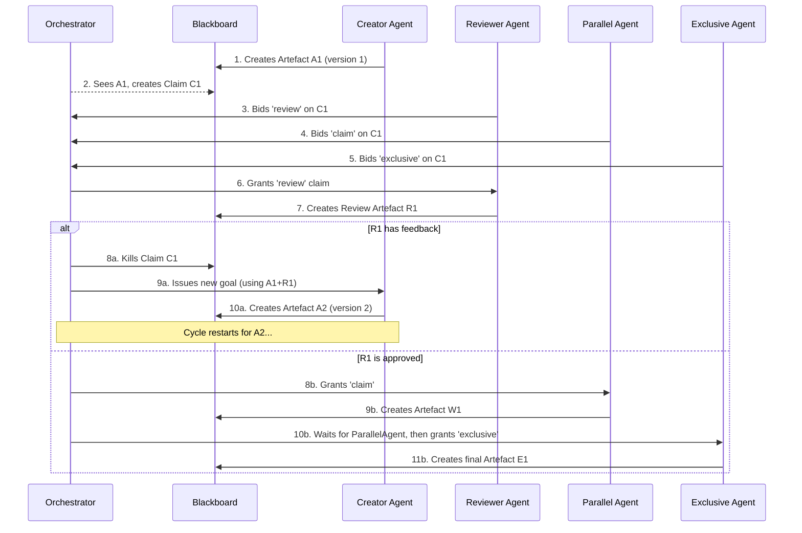

# **The Holt Orchestrator Component: Design & Specification**

**Purpose**: Orchestrator component logic, algorithms, and implementation details  
**Scope**: Component-specific - read when implementing orchestrator features  
**Estimated tokens**: ~3,200 tokens  
**Read when**: Implementing orchestrator logic, claim management, event handling

## **1. Core purpose**

The Orchestrator is the central coordination engine of Holt. It is a lightweight, event-driven component that serves as a non-intelligent traffic cop, managing the lifecycle of Claims and coordinating agent work without making domain-specific decisions.

Its fundamental purpose is to:
- Watch for new Artefacts on the blackboard
- Create corresponding Claims based on those Artefacts  
- Coordinate the bidding process with all agents
- Manage the phased execution of granted Claims
- Handle failures and maintain system integrity

The Orchestrator does **not** contain business logic or domain knowledge. All intelligence for bidding and work execution resides within the Agent Pups.

## **2. System bootstrapping**

The Orchestrator becomes active after the CLI initiates a workflow. The CLI is the first actor responsible for seeding the system with its initial state.

### **Prerequisites validation**

The Orchestrator relies on the CLI to ensure prerequisites are met:
* A clean, initialised Git repository is required
* When `holt forage` is run, the CLI performs critical checks:
  * Verifies that a `.git` directory exists
  * Verifies that the Git working directory is clean (no uncommitted changes or untracked files)
* The root of this verified Git repository becomes the workspace mounted into agent containers

### **Initial workflow trigger**

1. The `holt forage --goal "Create a REST API"` command connects to the Redis instance
2. The CLI creates the very first Artefact on the blackboard with these properties:
   * `structural_type`: Standard
   * `type`: GoalDefined (a special, reserved type)
   * `payload`: The raw string from the --goal flag
   * `produced_by_role`: user
3. This artefact's appearance triggers the Orchestrator to create the first Claim, starting the automated workflow

## **3. Core orchestration logic**

### **3.1. Event-driven architecture**

The Orchestrator operates as a pure event-driven system:

1. **Artefact monitoring**: The Orchestrator's primary loop subscribes to the `artefact_events` Redis Pub/Sub channel
2. **Immediate response**: When any component creates a new artefact, it publishes the artefact_id to this channel
3. **Claim creation**: The Orchestrator receives notifications immediately, reads the artefact, and creates a corresponding Claim
4. **Agent notification**: It announces new claims to all agents by publishing the claim_id to the `claim_events` channel

### **3.2. Full consensus model (V1)**

The Orchestrator implements a "full consensus" bidding model to ensure deterministic, debuggable workflows:

1. **Bid collection**: The Orchestrator waits until it has received a bid (including explicit 'ignore' bids) from every known agent
2. **Agent registry**: The list of "known agents" comes from the holt.yml configuration loaded at startup
3. **Timeout handling**: V1 does not implement bid timeouts - the system waits indefinitely for all agents to respond
4. **Deterministic processing**: This ensures workflows are completely reproducible and debuggable

### **3.3. Phased claim process**

The Orchestrator manages Claims through a strict three-phase lifecycle:

#### **Phase 1: Review (pending_review)**
* **Grant criteria**: All agents that submitted 'review' bids are granted
* **Execution**: Granted agents produce Review artefacts  
* **Feedback detection**: Any Review payload that is not precisely `{}` or `[]` is considered feedback
  * **Strict parsing**: This includes malformed JSON, simple strings, or any other content
  * **Binary decision**: The check is purely syntactic - the Orchestrator does not interpret feedback content
* **Outcomes**:
  * If any Review contains feedback → status moves to `terminated` (claim is dead)
  * If all reviews pass (exactly `{}` or `[]`) → status moves to `pending_parallel`

#### **Phase 2: Parallel (pending_parallel)**
* **Grant criteria**: All agents that submitted 'claim' bids are granted
* **Execution**: Granted agents work concurrently on the artefact
* **Completion**: Once all parallel tasks complete → status moves to `pending_exclusive`

#### **Phase 3: Exclusive (pending_exclusive)**  
* **Grant criteria**: The Orchestrator grants the claim to one exclusive bidder using first-bid-wins policy
* **Execution**: The single granted agent gets exclusive access to work on the artefact
* **Completion**: Once the exclusive task completes → status moves to `complete`

### **3.4. Agent failure handling**

The Orchestrator treats failure as a first-class event:

1. **Failure detection**: If a granted agent fails (container crash, timeout, invalid output)
2. **Failure artefact**: The Orchestrator posts a new Failure artefact containing error details
3. **Claim termination**: The corresponding Claim status is set to `terminated`
4. **Atomic phases**: Each claim phase is atomic - if any agent in a parallel phase fails, the parent Claim is terminated

### **3.5. Workflow termination**

The Orchestrator recognizes workflow completion through Terminal artefacts:

1. **Terminal detection**: An agent can produce an artefact with `structural_type: Terminal`
2. **No claim creation**: The Orchestrator never creates Claims for Terminal artefacts
3. **Reference validation**: Every Terminal artefact must reference the original GoalDefined artefact's ID
4. **Completion criteria**: A user's goal is achieved when the primary thread ends in a Terminal artefact and no active claims remain

## **4. Workflow sequence diagram**

## **5. Orchestrator-specific Redis interactions**

### **5.1. Pub/Sub channel management**

The Orchestrator is responsible for:
* **Subscribing** to `artefact_events` channel for new artefact notifications
* **Publishing** to `claim_events` channel when new claims are created
* **Connection resilience**: Implementing retry logic with exponential backoff for Redis failures

### **5.2. Claim state management**

The Orchestrator maintains Claims through their complete lifecycle:
* **Creation**: Writing new Claim objects to `holt:{instance_name}:claim:{uuid}`
* **Status updates**: Atomic updates to claim status fields
* **Bid collection**: Reading from `holt:{instance_name}:claim:{uuid}:bids` to gather agent responses
* **Granted agent tracking**: Maintaining lists of granted agents for each phase

### **5.3. Agent registry management**

The Orchestrator must maintain an accurate registry of known agents:
* **Startup initialization**: Load agent list from holt.yml configuration
* **Bid validation**: Ensure bids come only from known agents
* **Consensus enforcement**: Require bids from all registered agents before proceeding

## **6. Error handling and resilience**

### **6.1. Redis connection failures**

The Orchestrator implements robust Redis connectivity:
* **Connection retry**: Exponential backoff policy with configurable retry limits
* **Health check failure**: If Redis is unreachable after retries, health checks fail and process exits
* **State recovery**: Upon reconnection, the Orchestrator resumes watching for new artefacts

### **6.2. Agent timeout handling**

V1 Implementation approach:
* **No bid timeouts**: The Orchestrator waits indefinitely for all agent bids
* **Container health**: Relies on container orchestration (Docker/Kubernetes) to detect dead agents
* **Future enhancement**: V2 will implement configurable bid timeouts

### **6.3. Partial failure recovery**

The Orchestrator handles partial failures atomically:
* **Phase atomicity**: Each claim phase is all-or-nothing
* **Parallel phase failure**: If any agent in parallel phase fails, entire claim terminates
* **No automatic retry**: Failed claims require manual intervention to restart workflow

### **6.4. Data consistency**

The Orchestrator ensures blackboard consistency:
* **Atomic updates**: All claim status changes are atomic Redis operations  
* **Idempotent operations**: Duplicate artefact notifications don't create duplicate claims
* **State validation**: Validates claim state before transitions

## **7. Configuration and environment**

### **7.1. Environment variables**

The Orchestrator requires these environment variables:
* **HOLT_INSTANCE_NAME**: The name of the holt instance (e.g., my-first-holt)
* **REDIS_URL**: Connection string for the blackboard (e.g., redis://holt-my-first-holt-redis:6379)
* **HOLT_CONFIG_PATH**: Path to the holt.yml configuration file

### **7.2. Configuration loading**

The Orchestrator loads configuration at startup:
* **Agent registry**: Reads the complete list of agents from holt.yml
* **Service overrides**: Applies any service-level configuration overrides
* **Validation**: Ensures configuration is valid and complete before starting

## **8. Health checks and monitoring**

### **8.1. Health check endpoint**

The Orchestrator exposes a health check at `GET /healthz`:
* **200 OK**: Connected to Redis and able to read/write
* **503 Service Unavailable**: Redis connection failed or configuration invalid

### **8.2. Operational monitoring**

The Orchestrator provides structured logging for:
* **Claim lifecycle events**: Creation, phase transitions, completion, termination
* **Agent bid tracking**: Bid collection progress and consensus achievement
* **Error conditions**: Redis failures, invalid bids, configuration problems
* **Performance metrics**: Claim processing times, bid collection duration

### **8.3. Debugging support**

The Orchestrator supports operational debugging:
* **State inspection**: Current claims and their status via Redis CLI
* **Event tracing**: Complete audit trail of all decisions and state changes
* **Agent tracking**: Visibility into which agents have bid on which claims

## **9. Integration with other components**

### **9.1. Agent Pup coordination**

The Orchestrator coordinates with Agent Pups through:
* **Claim notifications**: Publishing new claim IDs to `claim_events` channel
* **Bid collection**: Reading bids from claim-specific Redis hashes
* **Work assignment**: Implicit work assignment through claim grants

### **9.2. CLI integration**

The Orchestrator works with the CLI through:
* **Shared Redis instance**: Both components connect to the same Redis blackboard
* **Artefact creation**: CLI creates initial GoalDefined artefacts that trigger workflows
* **State visibility**: CLI commands read orchestrator-managed state for user display

### **9.3. Blackboard interaction**

The Orchestrator is the primary manager of blackboard state:
* **Artefact monitoring**: Watches for new artefacts created by CLI or agents
* **Claim management**: Creates, updates, and terminates claims
* **State consistency**: Ensures blackboard state remains consistent and valid

This component design ensures the Orchestrator remains focused, predictable, and maintainable while providing the coordination needed for complex multi-agent workflows.