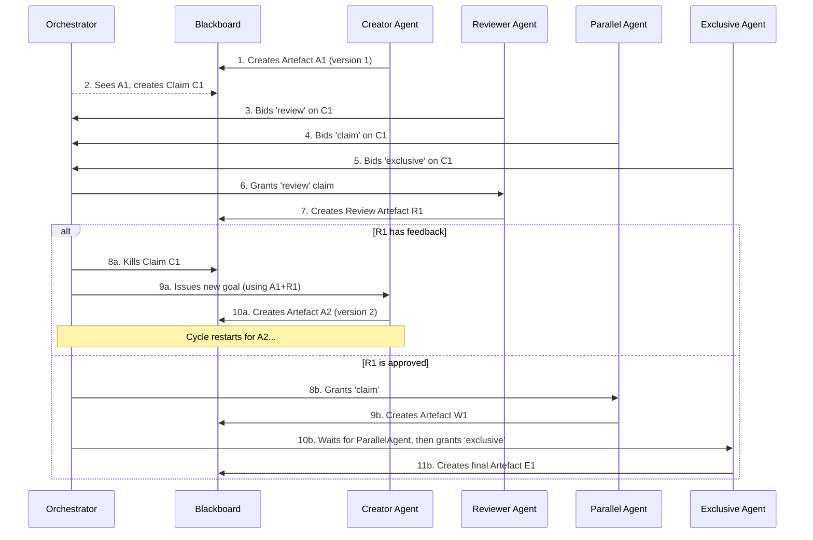

# **Sett: A container-native AI agent orchestrator**

Sett is a standalone, **container-native orchestration engine** designed to manage a clan of specialised, tool-equipped AI agents. It provides a robust, scalable, and auditable platform for automating complex workflows by leveraging the power of containerisation and the familiar paradigms of DevOps. While initially focused on software engineering tasks, Sett's immutable audit trails and human-in-the-loop design make it particularly valuable for regulated industries, compliance workflows, and any environment where AI transparency and accountability are business-critical.

It is not an LLM-chaining library. It is an orchestration engine for the real-world toolchains that software professionals use every day. It enables the automation of tasks that rely on compilers, CLIs, and infrastructure tools (git, docker, kubectl) by orchestrating agents whose tools are not just Python functions, but any command-line tool that can be packaged into a container.

## **Guiding principles**

Sett is an opinionated tool. Our development philosophy is guided by a clear set of principles that prioritise simplicity, robustness, and pragmatism.

* **Pragmatism over novelty (YAGNI):** We prioritise using existing, battle-hardened tools rather than building our own. The core of Sett is an orchestrator, not a database or a container runtime. We use Docker for containers and Redis for state, because they are excellent.  
* **Zero-configuration, progressively enhanced:** The experience must be seamless out of the box. A developer should be able to get a basic sett running with a single command. Smart defaults cover 90% of use cases, while advanced features and enterprise-grade workflows are available for those who need them.  
* **Small, single-purpose components:** Each element in the system—the orchestrator, the CLI, the agent cub—has a clear, well-defined job and does that one thing excellently. Complexity is managed by composing simple parts.  
* **Auditability is a core feature:** Artefacts are immutable. Every decision and agent interaction is recorded on the blackboard, providing a complete, auditable history of the workflow. This makes Sett particularly valuable for regulated industries, compliance workflows, and any environment where AI transparency and accountability are legally required or business-critical.  
* **ARM64-first design:** Development and deployment are optimised for ARM64, with AMD64 as a fully supported, compatible target.  
* **Principle of least privilege:** Agents run in non-root containers with the minimal set of privileges required to perform their function.

## **How it works: the claim and artefact lifecycle**

The architecture separates concerns between the **Orchestrator** and the **Agents**. The Orchestrator watches for new **Artefacts** and creates **Claims** based on them. Agents watch for **Claims** and bid on them. This creates a robust, event-driven workflow.

### **System bootstrapping**

A workflow is initiated by a user via the sett CLI. The CLI is the first actor and is responsible for seeding the system with its initial state.

**Prerequisites:**
* A clean, initialised Git repository is required. Sett will refuse to run in an unclean environment.
* When `sett forage` is run, it performs two critical checks:
  * Verifies that a `.git` directory exists. If not, the command fails with an error instructing the user to initialise a repository.
  * Verifies that the Git working directory is clean (no uncommitted changes or untracked files). If dirty, the command fails.
* The root of this verified Git repository becomes the workspace mounted into agent containers.

**Initial workflow:**
1. The `sett forage --goal "Create a REST API"` command connects to the Redis instance for the specified sett.
2. It creates the very first Artefact on the blackboard with these properties:
   * `structural_type`: Standard
   * `type`: GoalDefined (a special, reserved type)
   * `payload`: The raw string from the --goal flag
   * `produced_by_role`: user
3. This artefact's appearance triggers the orchestrator to create the first Claim, starting the automated workflow.

### **Core orchestration logic**

1. **Immutability and lineage:** Artefacts are immutable. To handle iteration and feedback, agents create new artefacts that are part of a **logical thread**. This creates a clear historical chain without violating immutability.

2. **Claim creation:** The orchestrator's primary loop subscribes to the `artefact_events` Redis Pub/Sub channel. When any component creates a new artefact, it also publishes the artefact_id to this channel. The orchestrator receives this immediately, reads the artefact, and creates a corresponding Claim.

3. **Agent eligibility & bidding:** The orchestrator is a non-intelligent traffic cop. It announces new claims to all agents by publishing the claim_id to the `claim_events` channel. The intelligence to bid or ignore resides entirely within each agent's cub.

4. **Full consensus model (V1):** The orchestrator operates in "full consensus" mode, waiting until it has received a bid (including explicit 'ignore' bids) from every known agent before beginning the phased grant process. This ensures deterministic, debuggable workflows.

5. **Phased claim process:** The Claim object has a status field tracking its lifecycle:
   * **pending_review:** All review bids are granted. The orchestrator waits for all granted agents to produce Review artefacts.
     * **Strict feedback detection:** Any payload that is not precisely an empty JSON object (`{}`) or an empty JSON list (`[]`) is considered feedback. This includes malformed JSON, simple strings, or any other content.
     * If any Review artefacts contain feedback, status moves to `terminated`. The claim is dead.
     * If all reviews pass (exactly `{}` or `[]`), status moves to `pending_parallel`.
   * **pending_parallel:** All standard claim bids are granted. The orchestrator waits for all granted agents to complete their work.
     * Once all parallel tasks complete, status moves to `pending_exclusive`.
   * **pending_exclusive:** The orchestrator grants the claim to one exclusive bidder using first-bid-wins policy.
     * Once the exclusive task completes, status moves to `complete`.

6. **Handling agent failures:** Failure is a first-class event. If a granted agent fails:
   * The orchestrator posts a new Failure artefact containing error details.
   * The corresponding Claim status is set to `terminated`.
   * Each claim phase is atomic - if any agent in a parallel phase fails, the parent Claim is terminated.

7. **Workflow termination:** A workflow concludes when no new, actionable artefacts are being produced:
   * An agent can produce an artefact with `structural_type: Terminal`
   * The orchestrator never creates Claims for Terminal artefacts
   * Every Terminal artefact must reference the original GoalDefined artefact's ID
   * A user's goal is achieved when the primary thread ends in a Terminal artefact and no active claims remain

8. **Human in the loop:** The system supports human oversight and intervention:
   * Question artefacts can be escalated for human review
   * Users interact via `sett questions` and `sett answer` commands
   * Answer artefacts are posted to unblock waiting agents

### **Workflow sequence diagram**



## **The agent's intelligence: the cub**

An agent's intelligence is not held within the container itself; the container is stateless. The intelligence is generated at runtime by an **Agent Cub**.

The cub is a lightweight binary that runs as the entrypoint in every agent container. It is responsible for the entire agent lifecycle: watching for work, bidding, assembling context, executing the agent's specific tool, and posting results back to the blackboard. It operates concurrently, ensuring it can bid on new work even while executing a long-running task.

For a full breakdown of its architecture, event-driven model, and the tool execution contract, see the **agent-cub.md** design document.

## **Blackboard data structures**

The blackboard is the primary API of the system and serves as a lightweight ledger for an external, version-controlled system like Git. It stores metadata and pointers, not large data blobs. All components interact via these well-defined data structures stored in Redis. The schemas will be formalised into a Go package (pkg/blackboard/types.go) that will serve as the canonical source of truth.

### **Redis key patterns**

All keys are namespaced to the instance to enable multiple setts on the same Redis instance:

* `sett:{instance_name}:artifact:{uuid}` - Individual artefact data
* `sett:{instance_name}:claim:{uuid}` - Individual claim data  
* `sett:{instance_name}:claim:{uuid}:bids` - Bids for a specific claim
* `sett:{instance_name}:thread:{logical_id}` - Sorted set for version tracking

### **Redis Pub/Sub channels**

* `artefact_events` - For the orchestrator to watch for new artefacts
* `claim_events` - For agents to watch for new claims

### **Data structures**

#### **Artefacts (sett:{instance_name}:artifact:{uuid} - Redis Hash)**

The central, immutable data object in Sett.

* **id** (string): The unique UUID of this specific artefact
* **logical_id** (string): A shared UUID that groups all versions of the same logical artefact together. For the first version, logical_id is the same as id
* **version** (int): A simple, incrementing version number within a logical thread
* **structural_type** (string enum): The role an artefact plays in the orchestration flow. Hardcoded types the Orchestrator understands:
  * `Standard` - Regular workflow artefacts
  * `Review` - Review feedback artefacts
  * `Question` - Human input required
  * `Answer` - Human responses
  * `Failure` - Error reports
  * `Terminal` - Workflow completion markers
* **type** (string): A user-defined, domain-specific string that only agents care about. Opaque to the Orchestrator (e.g., "DesignSpec", "CodeSummary", "UnitTestResult", "GoalDefined")
* **payload** (string): The main content of the artefact. For code artefacts, this is a git commit hash. For Questions/Answers, this is plain text. For Reviews, this is JSON (empty = approval, non-empty = feedback)
* **source_artefacts** (string): A JSON-encoded array of UUIDs establishing the DAG of dependencies
* **produced_by_role** (string): The role of the agent that created this artefact

#### **Claims (sett:{instance_name}:claim:{uuid} - Redis Hash)**

A record of the Orchestrator's decisions about a specific Artefact.

* **id** (string): The UUID of the claim
* **artefact_id** (string): The ID of the artefact this claim is for
* **status** (string): The current state of the claim:
  * `pending_review` - Waiting for review phase completion
  * `pending_parallel` - Waiting for parallel phase completion  
  * `pending_exclusive` - Waiting for exclusive phase completion
  * `complete` - All phases finished successfully
  * `terminated` - Failed or killed due to feedback
* **granted_review_agents** (string): A JSON-encoded array of agent names (from sett.yml) whose review bids were granted
* **granted_parallel_agents** (string): A JSON-encoded array of agent names whose claim bids were granted
* **granted_exclusive_agent** (string): The single agent name whose exclusive bid was granted

#### **Bids (sett:{instance_name}:claim:{uuid}:bids - Redis Hash)**

A collection of bids submitted by agents for a specific claim.

* **Key-Value Pairs:** The hash is a map where each key is the agent's **logical name** (e.g., 'go-coder-agent' from sett.yml) and the value is its bid type:
  * `review` - Request to review the artefact
  * `claim` - Request to work on the artefact in parallel
  * `exclusive` - Request exclusive access to work on the artefact
  * `ignore` - Explicit declaration of no interest

#### **Thread tracking (sett:{instance_name}:thread:{logical_id} - Redis Sorted Set)**

Efficient "latest version by logical_id" lookup using Redis ZSET. For each logical thread, artefact_ids are added with their version as the score. Getting the latest version is a single `ZREVRANGE ... LIMIT 1` call.

### **Large payload handling**

The agent's container has the project's working directory mounted. The payload for a code artefact is a git commit hash. The agent's command script is responsible for executing `git checkout <hash>` to get the codebase into the correct state before running its tools.

## **The sett.yml configuration file**

The sett.yml file is the central, declarative configuration for a Sett instance. It defines the clan of agents available to the orchestrator.

### **Agent definition**

In Sett, we use the term **Agent** to describe any containerised component that performs work. An agent can be an intelligent, LLM-driven actor (like a code generator) or a simple, deterministic tool (like a test runner). This distinction is an implementation detail of the agent itself; the orchestrator treats them all as tool-equipped containers.

Each agent is defined under the agents key in sett.yml.

```yaml
version: '1.0'

# Defines the clan of agents available to the orchestrator
agents:
  # This is the agent's unique logical name
  go-coder-agent:
    # The agent's functional role for claim routing
    # Multiple agents can share the same role
    role: 'coder'
    
    # Standard Docker build context OR pre-built image
    build:
      context: './agents/go-coder'
    # Alternative: use pre-built image
    # image: 'my-registry/go-coder-agent:latest'
    
    # The mandatory command the cub will execute for this agent
    # This is the entrypoint for the agent's specific logic
    command: ["/usr/bin/run-go-coder.sh"]
    
    # Defines how many instances of this agent can run in parallel
    # If replicas > 1, the strategy must be 'fresh_per_call'
    # Defaults to 1 if omitted
    replicas: 3
    
    # Agent container lifecycle strategy
    # 'reuse' (default) - container started once and left running
    # 'fresh_per_call' - new container for every granted claim
    # Must be 'fresh_per_call' if replicas > 1
    strategy: 'fresh_per_call'
    
    # Defines the project workspace mounted into the container
    # Path is relative to where the 'sett' command is run
    workspace:
      # 'ro' for read-only, 'rw' for read-write
      mode: 'rw'
    
    # Environment variables injected into the container
    # Mirrors docker-compose syntax
    environment:
      # Injects the value from the host's environment
      - GITHUB_TOKEN
      # Sets a specific value inside the container
      - LOG_LEVEL=debug
    
    # Resource constraints for the agent container
    # Mirrors docker-compose syntax
    resources:
      limits:
        cpus: '0.50'
        memory: 512M
      reservations:
        cpus: '0.25'
        memory: 256M
    
    # Optional prompts for LLM-driven agents
    # This section is optional for deterministic agents
    # Prompts are passed to the agent as environment variables
    prompts:
      claim: |
        You are a senior Go developer...
      execution: |
        You are a senior Go developer...

# Optional: Overrides for core infrastructure services
services:
  orchestrator:
    image: 'sett/orchestrator:v0.1.0'
  redis:
    image: 'redis:7-alpine'
```

## **Agent scaling and concurrency**

Sett supports two distinct operational models depending on the `replicas` configuration for each agent.

### **Single-instance agents (replicas: 1)**

For agents with `replicas: 1` (the default), the orchestrator manages a single container instance that runs the full agent cub with both bidding and execution capabilities. This is the standard model described in the agent-cub.md document.

### **Scalable agents (replicas > 1): Controller-Worker pattern**

For agents configured with `replicas > 1`, Sett uses a **controller-worker pattern** to eliminate race conditions and provide clean separation of concerns. This pattern consists of two distinct components:

#### **1. The Controller Cub ("bidder-only" mode)**

When `sett up` is run, the orchestrator launches **one and only one** persistent container for the scalable agent (e.g., `go-coder-agent`).

The cub process within this container runs in a special **"bidder-only" mode**:
- It runs only the Claim Watcher goroutine
- It watches for all new claims and evaluates them on behalf of its agent type
- It submits bids to the orchestrator
- **The Work Executor goroutine is disabled** - it never performs any work itself
- This container remains running throughout the sett's lifecycle

#### **2. The Worker Cubs ("execute-only" mode)**

When the orchestrator decides to grant a claim to a scalable agent, it **cannot** assign the work to the persistent controller cub. Instead:

1. **Ephemeral container creation**: The orchestrator spins up a new, ephemeral container using the same agent image
2. **Direct work assignment**: The cub process in this new container is launched in **"execute-only" mode** with the granted `claim_id` passed as a command-line argument: `cub --execute-claim <claim_id>`
3. **Single-purpose execution**: This "worker cub" has no Claim Watcher loop. It:
   - Starts and sees its direct assignment
   - Performs the work for that single claim
   - Posts the resulting artefact to the blackboard
   - Exits cleanly
4. **Container cleanup**: The orchestrator is responsible for cleaning up the ephemeral container

#### **Benefits of the controller-worker pattern**

- **Eliminates race conditions**: Only one persistent container bids, avoiding confusion about work assignment
- **Clean separation of concerns**: Bidding logic remains centralized while execution scales horizontally
- **Resource efficiency**: Work containers only exist when needed
- **Simplified orchestration**: Clear ownership of each claim and predictable container lifecycle

#### **Implementation scheduling**

This controller-worker pattern is fundamental to multi-agent coordination and will be implemented as part of **Phase 3: "Coordination"** of the delivery roadmap.

## **The thematic CLI**

The sett CLI is designed to be intuitive and memorable, using the sett metaphor to create a cohesive user experience.

### **Project management commands**

* **`sett init`** - Bootstrap command that scaffolds a new project with:
  * `sett.yml` - Pre-populated configuration file with commented example agent
  * `agents/` - Directory to hold agent definitions
  * `agents/example-agent/` - Example agent with Dockerfile and simple run.sh script

### **Sett lifecycle commands**

* **`sett up --name <instance>`** - Brings a new sett online
* **`sett down --name <instance>`** - Takes a sett offline, cleaning up all resources
* **`sett list`** - Lists all active setts on the host

### **Workflow commands**

* **`sett forage --goal "Your goal here"`** - The primary command to start a new task. Creates the initial GoalDefined artefact that triggers the workflow
* **`sett watch --name <instance>`** - Provides a live view of the sett's activity log

### **Inspection commands**

* **`sett hoard --name <instance>`** - Lists all artefacts produced by the agents
* **`sett unearth <artefact-id>`** - Retrieves the content of a specific artefact

### **Human-in-the-loop commands**

* **`sett questions [--wait]`** - Lists and manages questions escalated for human review
  * Default mode: Lists all currently unanswered Question artefacts (and their IDs) and exits
  * With `--wait` flag: Blocks until a new Question artefact appears, prints its details and ID, then exits
* **`sett answer <question-id> "<answer-text>"`** - Responds to a specific question. Creates the corresponding Answer artefact on the blackboard, unblocking waiting agents

### **Debug and monitoring commands**

* **`sett logs <agent-logical-name>`** - Debug tool that provides a user-friendly wrapper around `docker logs`. Translates the agent's logical name into the full, namespaced container name and streams the logs using the Docker Go SDK. Works for both running `reuse` agents and stopped containers from `fresh_per_call` agents

## **Error handling and resilience**

### **Redis failures**
The orchestrator and cubs implement a connection-retry policy with exponential backoff. If Redis is unreachable after retries, their health checks will fail, and the processes will exit loudly.

### **Agent crashes**
If an agent container dies, the orchestrator will post a Failure artefact and terminate the parent Claim. The work is considered lost.

### **Partial failures**
Each claim phase is an atomic, all-or-nothing transaction. If any agent in a parallel phase fails, the orchestrator will terminate the parent Claim and will not proceed to the next phase.

### **Failure recovery**
When a Failure artefact is created, the workflow for that claim stops. For V1, the only next step is manual intervention. A human operator must inspect the failure, diagnose the problem, and restart the entire workflow from the beginning with `sett forage`. Resuming or restarting a failed workflow is not supported in V1.

## **Human interaction details**

### **Question/Answer workflow**
The Question/Answer flow is managed via a simple, scriptable, two-command CLI interface:

**Question format:** The payload for Question artefacts is a simple string containing the text of the question.

**Answer format:** The payload for Answer artefacts is a simple string containing the answer text.

**Question escalation:** A script can create a Question artefact by outputting specific JSON to stdout:
```json
{
  "structural_type": "Question",
  "payload": "The design spec is ambiguous about null handling. Is it in scope?"
}
```

### **Review logic**
The review process is deterministic with clear pass/fail definitions:

**Feedback detection:** The Review artefact's payload determines the outcome:
* Empty JSON object `{}` or empty list `[]` = approval
* Any other valid JSON (e.g., `{"comments": ["..."]}`) = feedback

**Decision-making:** The Orchestrator makes decisions based on a simple check: is the Review artefact's payload empty? It does not interpret the content of feedback.

**Feedback loop:** When a claim is terminated due to feedback, the Orchestrator's new task for the original agent will include both the original artefact and the Review artefact in its source_artefacts, providing necessary context for the next iteration.

## **Technical implementation details**

### **Project structure**
The project uses the standard Go layout for multiple binaries:

```
sett/
├── cmd/             # Binaries: sett, orchestrator, cub
├── pkg/             # Shared public packages (e.g., blackboard types)
├── internal/        # Private implementation details
├── agents/          # Example agent definitions (Dockerfiles, scripts)
└── Makefile
```

### **Prerequisites**

* Go (version 1.22 or later)
* Docker Engine
* make

### **Build & deployment**

**Container images:** Simple, multi-stage Dockerfiles produce minimal, secure agent images.

**Makefile targets:** Standard targets: `build`, `test`, `lint`, `docker-build-all`, `clean`.

**Deployment model:** The primary target is Docker on a local machine. Kubernetes is a future consideration.

### **Build & run**

1. **Clone the repository:**
   ```bash
   git clone https://github.com/your-repo/sett.git
   cd sett
   ```

2. **Build all binaries:**
   ```bash
   make build
   ```
   This will place the sett CLI binary in the ./bin/ directory.

3. **Run your first sett:**
   ```bash
   ./bin/sett up --name my-first-sett
   ```

4. **Tear it down:**
   ```bash
   ./bin/sett down --name my-first-sett
   ```

### **Testing strategy**

**Unit vs integration:** Dependency injection and mock implementations of the blackboard client for fast unit tests. For integration tests, the testcontainers-go library manages ephemeral Redis instances.

**LLM mocking:** Agent command scripts are tested by pointing them to a mock HTTP server that returns pre-defined LLM responses.

### **Health checks and monitoring**

**Health check endpoints:** The orchestrator and cubs expose a `GET /healthz` endpoint. Returns `200 OK` if connected to Redis, `503 Service Unavailable` otherwise.

**Monitoring:** V1 uses high-quality, structured (JSON) logging to stdout.

## **Professional standards**

* **Comprehensive testing**: A minimum of 35% test coverage is required, with a healthy mix of unit, integration, and E2E tests.  
* **CI/CD automation**: All builds, tests, and security scans are managed via GitHub Actions.  
* **Makefile automation**: All common development tasks (build, test, lint, clean) are available as make targets.

## **Phased delivery plan**

The following phased approach ensures risk-minimized delivery that builds core infrastructure first:

### **Phase 1: "Heartbeat" - Core Infrastructure**
*Goal: Prove the blackboard architecture works*

**Deliverables:**
- Redis blackboard with complete key schemas
- Basic orchestrator (artifact watching, claim creation)
- CLI commands: `sett up`, `sett down`, `sett list`, `sett forage`
- Basic artifact creation and claim lifecycle

**Success Criteria:**
- `sett forage --goal "hello world"` creates initial artifact
- Orchestrator creates corresponding claim
- System state visible via Redis CLI

### **Phase 2: "Single Agent" - Basic Execution**
*Goal: One agent can claim and execute work*

**Deliverables:**
- Agent cub binary with claim watching
- Basic agent execution (one simple agent type)
- Git integration (checkout, commit workflow)
- CLI commands: `sett watch`, `sett hoard`, `sett unearth`

**Success Criteria:**
- End-to-end workflow: forage → claim → execute → artifact
- Agent can modify code and commit results
- Full audit trail on blackboard

### **Phase 3: "Coordination" - Multi-Agent Workflow**
*Goal: Review → Parallel → Exclusive phases working*

**Deliverables:**
- Full consensus bidding model
- Review/Parallel/Exclusive phase execution
- Multiple agent types working together
- Failure handling and Failure artifacts

**Success Criteria:**
- Complex workflow with review feedback loop
- Multiple agents working in parallel
- Proper error handling and recovery

### **Phase 4: "Human-in-the-Loop" - Production Ready**
*Goal: Full featured system with human oversight*

**Deliverables:**
- Question/Answer artifact system
- CLI commands: `sett questions`, `sett answer`
- Health checks and monitoring
- Complete documentation

**Success Criteria:**
- Complex workflows with human decision points
- Production-ready operational features
- Comprehensive error handling